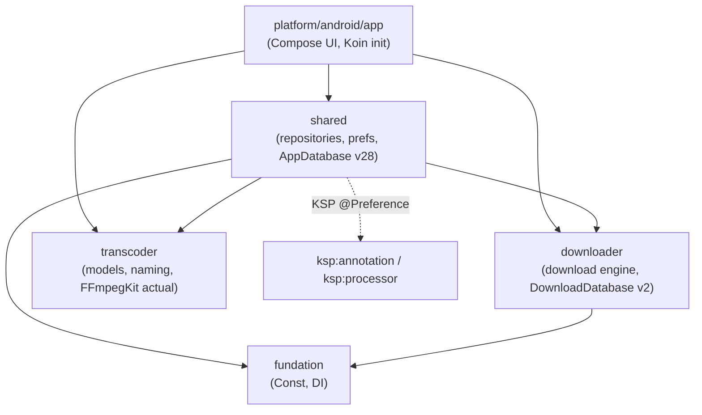

# Architecture

> Developer reference for the podcast-downloader + transcode-to-MP3 feature forked from PodAura.
> This document describes the **as-implemented** code on `master`. For the end-to-end download → transcode → SAF runtime flow, see [TRANSCODE_FLOW.md](./TRANSCODE_FLOW.md).

## 1. Project overview

This repository is a fork of [PodAura](https://github.com/SkyD666/PodAura) (Kotlin Multiplatform, GPL-3.0) that adds three capabilities on top of the original podcast reader/player:

1. **Download podcast episodes** from feeds the user subscribes to.
2. **Auto-transcode** the downloaded audio to MP3 (via FFmpegKit, `-c:a libmp3lame`) at a user-selected bitrate.
3. **Write the transcoded file into a user-selected SAF directory** (Storage Access Framework), organized as `{root}/{showName}/{name}.mp3`, with a configurable naming template.

The feature is opt-in: it activates only when the user enables *Auto transcode to MP3* **and** picks a SAF download root directory. When inactive, the base PodAura download-to-media-library behavior is preserved exactly.

**Stack:** Kotlin 2.4.10 / KMP / AGP 9.3.1 / JDK 25 / compileSdk 37 / Room3 / Koin 4.2.2 / FileKit 0.14.2 (SAF) / FFmpegKit (audio variant, `com.arthenica.ffmpegkit`) / DataStore preferences / Kermit logging.

## 2. Module structure

The Gradle modules (from `settings.gradle.kts`) that participate in this feature:

| Module | Role |
|---|---|
| `fundation` | Config (`Const`, incl. `DOWNLOAD_TEMP_DIR`), DI helpers (`get` / `inject`), extensions. `expect`/`actual` per platform. |
| `shared` | commonMain business logic (repositories, preferences, DB, UI screens) + `androidMain`/`appleMain`/`jvmMain` actuals. Holds DataStore preferences, Room `AppDatabase` (v28), and the download repository that hooks transcode in. |
| `downloader` | Generic download engine. Room `DownloadDatabase` (v2), WorkManager worker, notifications. Has **no** dependency on `shared` — stays generic. |
| `transcoder` | KMP module: pure commonMain models + naming, `expect class Transcoder` with `androidMain` actual backed by FFmpegKit. Independently unit-testable. |
| `platform/android/app` | Compose UI, Koin app setup (`initKoin`), entry point. |
| `ksp:processor` / `ksp:annotation` | KSP pipeline that auto-registers `@Preference` objects. |
| `htmlrender`, `compottie:core`, `compottie:main`, `platform:android:benchmark` | Pre-existing PodAura modules, unrelated to this feature. |

### Compile-time dependency graph (feature-relevant edges only)



Key edges confirmed in code:
- `shared` imports `com.skyd.downloader.*`, `com.skyd.transcoder.*`, and `com.skyd.fundation.*` (see `shared/.../di/Koin.kt`, `TranscodeHook.kt`, `DownloadStarter.kt`).
- `downloader` does **not** depend on `shared` — this is deliberate. The transcode hook lives in `shared`, so the download engine stays generic.
- `transcoder` has no compile dependency on `shared`/`downloader`; it is wired in only through Koin (`transcoderModule`).

## 3. Koin module organization

`shared/.../di/Koin.kt::initKoin` registers nine modules in order:

```kotlin
modules(
    ioModule, databaseModule, dataStoreModule, pagingModule,
    repositoryModule, viewModelModule,
    downloaderModule, downloaderDatabaseModule,
    transcoderModule,
)
```

Feature-relevant registrations:

| Koin module | Registration | Source |
|---|---|---|
| `transcoderModule` | `single { Transcoder() }` | `transcoder/.../di/TranscoderModule.kt` |
| `repositoryModule` | `single { TranscodeHook() }` | `shared/.../di/RepositoryModule.kt` |
| `downloaderModule` | `Downloader`, `IDownloadManager` (`DownloadManager.instance`) | downloader module |
| `downloaderDatabaseModule` | `DownloadDatabase` + `DownloadDao` | downloader module |
| `databaseModule` | `AppDatabase` + DAOs (`EnclosureDao`, `ArticleDao`, …) | `shared/.../di/DatabaseModule.kt` |

`TranscodeHook` resolves its collaborators (`Transcoder`, `EnclosureDao`, `ArticleDao`, `DownloadDao`, `dataStore`) via `com.skyd.fundation.di.get` at use site, so it needs no constructor parameters.

## 4. Key design decisions

### 4.1 Hook point — `shared` layer, not the `downloader` module

The transcode hook lives entirely in `shared`. The `downloader` module is kept generic: it downloads a URL to a `path`/`fileName` and emits `Event.Success`; it knows nothing about articles, feeds, transcode, or SAF.

Two extension points in `shared`:
- **`DownloadStarter.download`** — chooses *where* the download lands. When the transcode path is active, it points the download at `Const.DOWNLOAD_TEMP_DIR` (a cache dir) instead of the media-library folder, and skips the article/group/folder computation the base path performs (because `TranscodeHook` re-resolves the article from `entity.url` on success).
- **`DownloadManager.listenDownloadEvent` → `Event.Success`** — chooses *what happens after*. When active, it calls `TranscodeHook.onDownloadSuccess(entity)` (wrapped in `runCatching` + `Logger.e`); otherwise it runs the base behavior (`MediaRepository.addNewFile` into the media library).

### 4.2 Download to cache temp → transcode → write SAF

FFmpegKit reads filesystem paths; SAF `content://` URIs cannot be fed to FFmpeg directly. So the flow is:

1. Download the original audio to `Const.DOWNLOAD_TEMP_DIR` (a real filesystem path under `cacheDir/downloads` on Android).
2. Transcode (if needed) to a `.tmp` file in the same temp dir.
3. Stream the bytes into the SAF tree via FileKit (`writeTranscodedToSaf`).
4. Delete the temp files (unless *Keep original* is on).

`Const.DOWNLOAD_TEMP_DIR` is declared `expect` in `fundation/.../config/Const.kt` and given an `actual` per platform (`cacheDir/downloads` on Android; analogous on iOS/macOS/JVM).

### 4.3 SAF via FileKit 0.14.2

- **Directory picker:** `rememberDirectoryPickerLauncher` (used in `TransmissionScreen`).
- **Persist permission across reboots:** `persistSafPermission(uri)` calls `ContentResolver.takePersistableUriPermission` with read+write flags. FileKit's picker does *not* call this itself, so without this step the tree URI becomes unusable after the process dies (e.g. a reboot). Implemented in `SafPermission.android.kt`; no-op on non-Android.
- **Write:** `writeTranscodedToSaf` (`SafWriter.android.kt`) navigates `root div showName`, creates the subdirectory with `createDirectories()`, resolves name collisions, and streams bytes with `tempFile.source().buffered().use { target.sink(append = false).use { input.transferTo(it) } }`. Returns the target's `content://` URI string.

### 4.4 DataStore + `@Preference` + KSP + CompositionLocal

Five preferences in `shared/.../model/preference/download/`, all following PodAura's existing pattern (`@Preference object : BasePreference<T>()`, KSP auto-registration, CompositionLocal exposure via `.current` / `.put(scope, …)`):

| Preference | Type | Default | Notes |
|---|---|---|---|
| `AutoTranscodeMp3Preference` | `Boolean` | `true` | Master switch. |
| `DownloadRootDirPreference` | `String` | `""` | SAF tree URI; empty = not configured. |
| `TranscodeBitratePreference` | `Int` | `128` | Allowed: 64, 96, 128, 192. |
| `DownloadNamingTemplatePreference` | `String` | `"TitleAndShow"` | One of `TitleAndShow`, `ShowNumberTitle`, `DateAndTitle`. |
| `KeepOriginalAfterTranscodePreference` | `Boolean` | `false` | Keep the downloaded source temp file after transcode. |

**Activation condition:** the transcode path runs iff `AutoTranscodeMp3Preference == true` **and** `DownloadRootDirPreference` is non-empty. Both `DownloadStarter` and `DownloadManager.listenDownloadEvent` re-check this pair, so the base behavior is preserved whenever the condition is false.

### 4.5 Room migrations (new `androidx.sqlite` API)

Both databases use the new `androidx.sqlite.SQLiteConnection` migration API (`override suspend fun migrate(connection: SQLiteConnection)` + `connection.execSQL`), not the legacy `SupportSQLiteDatabase`.

- **`AppDatabase` v27 → v28** (`Migration27To28`): adds the `season` TEXT column to `RssMediaBean` (`ALTER TABLE rss_media ADD season TEXT`), so `{seasonNumber}` can be populated end-to-end.
- **`DownloadDatabase` v1 → v2** (`MIGRATION_1_2`): adds `outputUri TEXT NOT NULL DEFAULT ''`, `transcodeStatus TEXT NOT NULL DEFAULT ''`, `finalSize INTEGER NOT NULL DEFAULT 0` to the `Download` table.

`AppDatabase.instance(...)` wires all 27 migrations (`Migration1To2` … `Migration27To28`); `DownloadDatabase.instance(...)` wires `MIGRATION_1_2`.

## 5. Naming & episode metadata

The `transcoder` module owns naming (pure commonMain, unit-tested):

- **`EpisodeMetadata`** (`transcoder/.../naming/EpisodeMetadata.kt`) — `showName`, `episodeTitle`, `episodeNumber: String?`, `seasonNumber: String?`, `pubDate: String?`. All fields are pre-formatted strings.
- **`NamingTemplate`** — enum with three presets (`TitleAndShow`, `ShowNumberTitle`, `DateAndTitle`) plus `render(metadata)`. `render` substitutes `{showName}` / `{episodeTitle}` / `{episodeNumber}` / `{seasonNumber}` / `{pubDate}` and sanitizes the result via `sanitizeFileNameSegment`.
- **`FileNameSanitizer`** — `sanitizeFileNameSegment` (internal) replaces `\ / : * ? " < > |` with `_`, collapses repeats, trims leading/trailing spaces/dots/underscores, truncates to `maxLength`; `sanitizeFileName(name, extension)` preserves the extension.

**`season` end-to-end:**
- RSS parse: `Item.itunesSeason` (`itunes:season` element) → `RssExt.toRssMediaBean` maps `season = itunesSeason`.
- DB: `RssMediaBean.season` (`@ColumnInfo(name = "season")`), column added by `Migration27To28`.
- Mapping: `EpisodeMetadataMapper.toEpisodeMetadata()` passes `media?.season` straight into `EpisodeMetadata.seasonNumber`.
- Render: `NamingTemplate.render` substitutes `{seasonNumber}` (no built-in preset currently uses it, but the variable is available for custom templates).

**`ArticleWithFeed` → `EpisodeMetadata` mapping** (`shared/.../download/EpisodeMetadataMapper.kt`):
- `showName` = feed title, falling back to feed url when blank.
- `episodeTitle` = article title, falling back to `"untitled"` when blank.
- `episodeNumber` / `seasonNumber` = pass-through from `RssMediaBean` (already `String?`).
- `pubDate` = article date (epoch millis) → ISO local date `yyyy-MM-dd` in the system timezone, or `null` when the article has no date.
